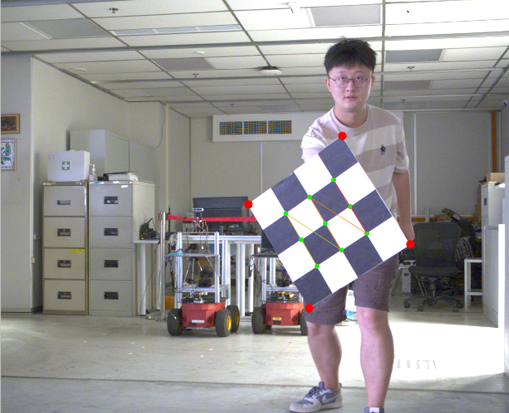
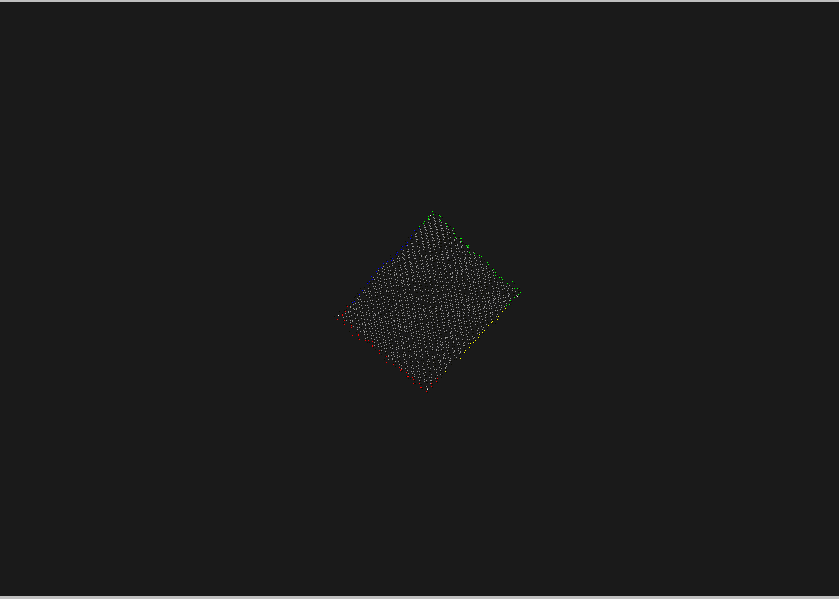
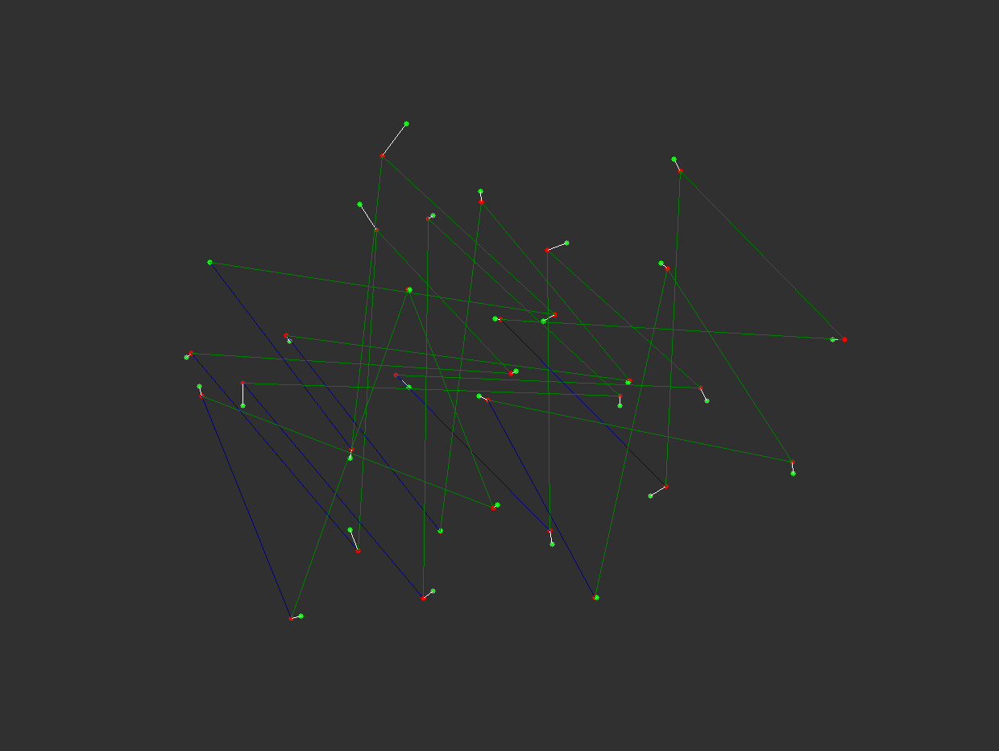
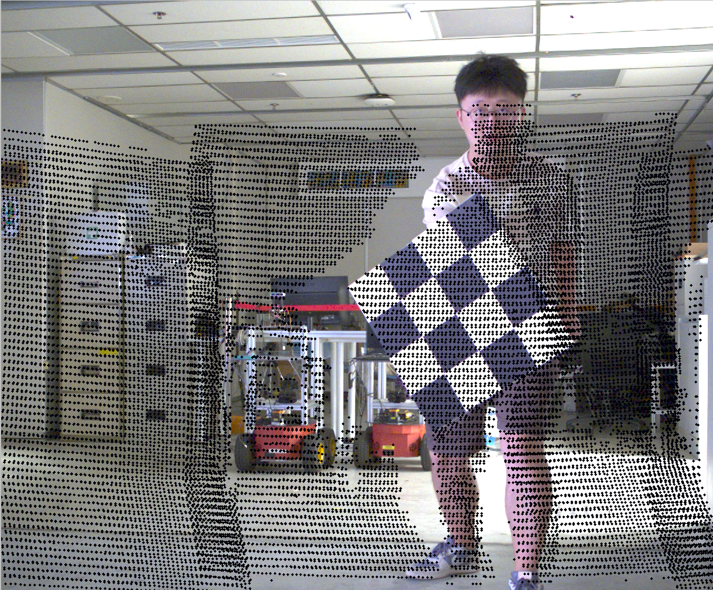
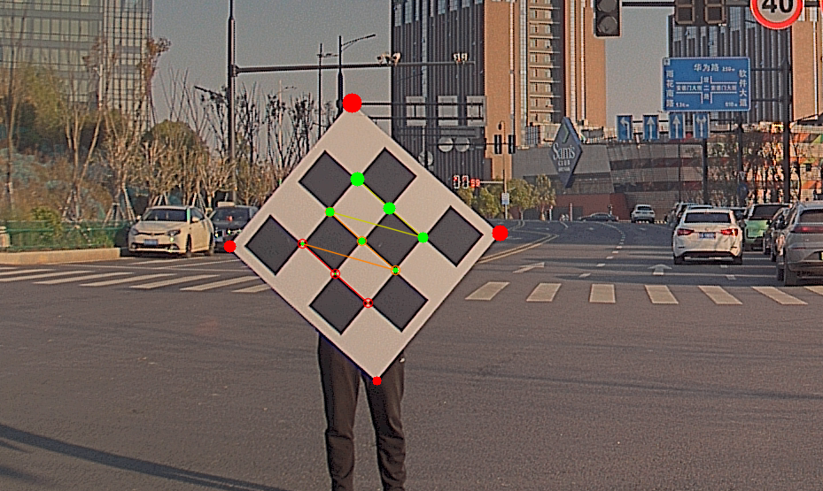
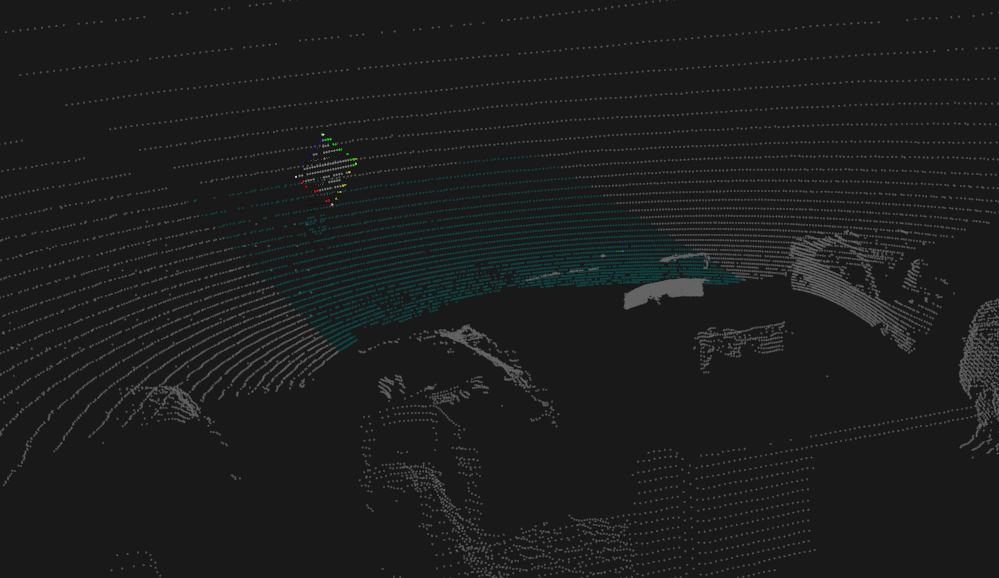
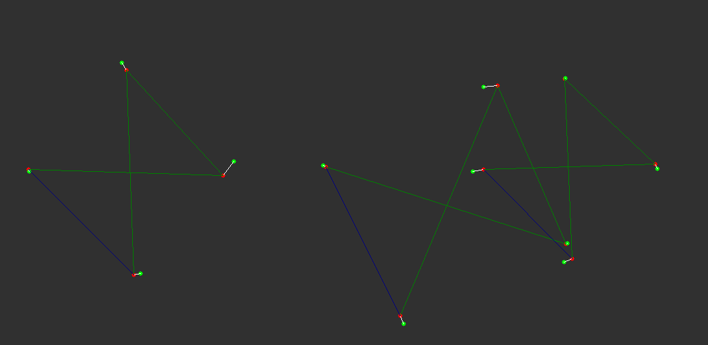
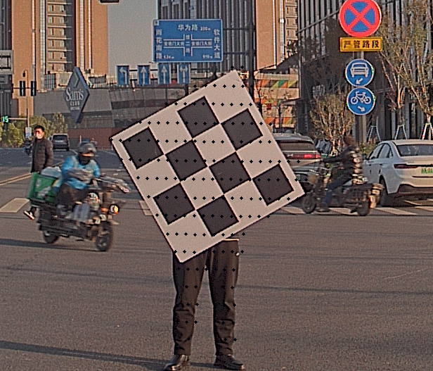

# Lidar-Camera-Calib (AutoCore)

## Overview

**LC-Calib** is a ligthweight automatic toolkit for offline 3D LiDAR to camera calibration. The fundametal idea of this tool can be described as following:

- corner / edge of chess board extraction from image and point cloud
- use pnp to calculate transformation roughly first
- use batch optimization based on multiple data pairs to obtain a more accurate result
- visual check to validate the result

To increase the optimization performance, it's supposed to collect several data pairs in different positions for calculation. And then follow the instructions below.

## Readme for Teleop Calibration

To better facilitate with calibration, some modifications have been made.
Please follow the following instrucitons for docker deployment and running guide.

## **Dockerfile**

Please refer the Dockerfile and start guide in the following link

https://www.notion.so/Camera-Lidar-Calibration-7674c27a63964b4db1c547fc543d52f9

## **Step By Step Running Guide**

### 1. Build the workspace

If u have correctly followed the start guide in the link above, we believe that u have successfully enter the container now it's time to build the workspace 

```shell
cd ~/catkin_ws
catkin build
source ./devel/setup.bash
```

### 2. Collect data for calibration

This repo mainly uses a few pairs of png and pcd file of a 3x3 calibration board with 0.108 width. (TODO:Support for other format is on the way)

So prepare the chessboard metioned above and let's get started for photograph.

[Python 3 Version](./src/autocore_camera_lidar_calib/data_pairs/detect.py)

[Python 2 Version](./src/autocore_camera_lidar_calib/data_pairs/detectpython2.py) (TODO:Test environment for python 2.7)

Now you can either run the python inside the docker or on the host. Be careful when taking photos for chessboard, the chessboard should always present itself completely in both camera scene and Lidar scene.

To run the python code run:（Here you can replace the python file with their name for respective python version)

```shell
python detect.py
```

The program will pop up a message showing that the corner is detected. If not try adjust the board angle and environment lightings.

Repeat the process above a few times. U will get a few pairs of png and pcd.

### 3. Manually edit the pcd file

To get a good structure for chessboard, editing the pcd file is a must. Open the cloud compare and edit the pcd file there (TODO:Need more instructions on cloud compare)

### 4. Feature Extraction

```shell
 roslaunch autocore_camera_lidar_calib feature_extract.launch pair_index:=YOUR_INDEX pair_name:=YOUR_NAME
```
YOUR_INDEX here refers to the index number of the pair 
YOUR_NAME here refers to the name of the pair

If it work well, the image below will be shown.



Next press any key, then the point cloud will be shown.



Close the image tab. And repeat the this step for other pairs.

### 5. Transform Calculation

Now you have already performed feature extraction for all pairs, let's calculate the transform matrix.

```shell
roslaunch autocore_camera_lidar_calib calculate_r_t.launch pair_num:=TOTAL_PAIR_NUMBER
```

TOTAL_PAIR_NUMBER is the total number of pairs u had processed in the last step.

Normally the tab will look like this



Congrat! Now the result is under results folder tf_front.yaml

### 6. Let's Validate!!!

```shell
roslaunch autocore_camera_lidar_calib visual_validate.launch pair_name:=YOUR_PAIR_NAME
```

YOUR_PAIR_NAME is the pair that u want to validate on.



### Find the original Readme below

## **Prerequisites**

- ROS1 (developed in melodic)

- PCL (developed in PCL 1.8.1)

- Eigen (developed in Eigen 3.3.4)

- OpenCV (developed in OpenCV 3.2.0)

- Ceres (developed in Ceres 2.0.0)

- yaml-cpp (developed in yaml-cpp 0.5.0)

## Calibration steps

### 1. Tool installation

Clone the source code of the project and build.

```shell
cd lidar-cam-calibrelated
catkin_make
```
### 2. Data preparation

The calibration tool reads image and point cloud directly. If you record the sensor data by rosbag, AutoCore provides a tool to extract the data (.png / .pcd) in this project as well (only ros2 version), see the folder "lidar_cam_reader " for details. Save the image and point cloud of chess board in the "data_pairs" folder.

AutoCore provides 4 data pairs, 3 of them are used to calculate transformation matrix and the last one is used for validation.

### 3. Feature extraction
Launch the "feature_extract.launch" file first to generate feature yaml file. Only one pair of data can be read at each time. In other words, if you have 10 sets of image and point cloud, you shall run 10 times. The following parameter shall be configured as:


| Param name | Description |
| ----- | ----- |
| pair_num_c | how many pairs have been used, start from 1, i.e. set it to 2 when using 2nd data pair and so on|
| pcd_file | pcd file saved path, default in the "data_pairs" folder|
| img_file | image file saved path, default in the "data_pairs" folder |
| feature_file | path to save feature file, default in the "results" folder |
| filter_x_forward | max forward distance along x-axis of point cloud to find chess board |
| filter_x_backward | max backward distance along x-axis of point cloud to find chess board |
| filter_y_left | max left distance along y-axis of point cloud to find chess board |
| filter_y_right | max right distance along y-axis of point cloud to find chess board |

In addition, user shoud configure the intrinsic parameter of camera in "config/calib.yaml".

```shell
cd lidar-cam-calibrelated
source devel/setup.bash
roslaunch autocore_camera_lidar_calib feature_extract.launch
```
Then you can see the corner of image marked in red and green:


The size of red marked points indicates the rotation.

click keyboard, the chess board in point cloud will be marked as well:


Then, you can see the feature_file saved in "results" folder which stores the corners' coordinate. 

Repeat this step to get all the corners from whole data pairs. Remember to increase parameter "pair_num_c" at every time, otherwise the previous corner will be replaced.

### 4. Calculate rotation and translation
Launch the "calculate_r_t.launch" file to generate calibration yaml file. This launch file takes all the corners' coordinates as input, before running this file, make sure that from "pari1" to "pairN" (in which N denotes the pairnum below) exist. The following parameter shall be configured as:


| Param name | Description |
| ----- | ----- |
| pairnum | how many pairs will be used, in accordance with the number of data pairs stored in the yaml file generated from last step|
| feature_file | feature file saved path, default in the "results" folder |
| calibration_file | path to save calibration file, default in the "results" folder |
| calibration_file_tf | path to save calibration tf file, default in the "results" folder |

In addition, user shoud configure the intrinsic parameter of camera in "config/calib.yaml".

```shell
cd lidar-cam-calibrelated
source devel/setup.bash
roslaunch autocore_camera_lidar_calib calculate_r_t.launch
```

Then you can see the corner matches each other as showed in the following figure:


And the calibration files are saved under above-defined path. The rotation vector and translation vector denote **the relation from lidar to camera**. 

### 5. Visual validation
Launch the "visual_validate.launch" file to check if the point cloud from validation data set could project on the image exactly. The following parameter shall be configured as:

| Param name | Description |
| ----- | ----- |
| pcd_file | pcd file saved path, default in the "data_pairs" folder|
| img_file | image file saved path, default in the "data_pairs" folder |
| calibration_file | calibration file saved path, default in the "results" folder |
| filter_x_forward | max forward distance along x-axis of point cloud to find chess board |
| filter_x_backward | max backward distance along x-axis of point cloud to find chess board |
| filter_y_left | max left distance along y-axis of point cloud to find chess board |
| filter_y_right | max right distance along y-axis of point cloud to find chess board |



The black points denote the projection of person holding chess board on the image. Most of the points are matched within the correct area, the transforamtion deviation is about several pixel through visual inspection.

## Sample dataset

### Dataset from AutoCore

Dataset for evaluating this calibration tool is available in "data_pairs" folder, including 4 images and the corresponding point cloud. Or you can download it at [here](https://drive.google.com/file/d/1Ts7FxQVgTtQzPdRLCGz2YTeOHTVSw4Ax/view?usp=share_link).
### Customized your own dataset

Since the tool takes image and .pcd file as input directly, there is alternatives other than ROS to record data. To collect effective data pairs, the following tips may help:

- Make sure the chess board fully detected by both sensors
- The more valid data pair, the better batch optimization performance (5 ~ 10 pairs)
- Remember the approximate location of chess board relative to the sensor, to adjust the parameter "filter_x" / "filter_y"


## Trouble shooting

There exists one known issue that caused by unmatched versions of dependencies, it's recommended to use the above-mentioned same version as developer.

## Credits

This code was developed by [AutoCore](https://autocore.ai/). For researchers that have leveraged or compared to this work, please cite the origin.

## Copyright
Copyright 2022 AutoCore

you may not use this file except in compliance with the License.
you may obtain a copy of the License at

   http://www.apache.org/licenses/LICENSE-2.0

Unless required by applicable law or agreed to in writing, software
distributed under the License is distributed on an "AS IS" BASIS,
WITHOUT WARRANTIES OR CONDITIONS OF ANY KIND, either express or implied.
See the License for the specific language governing permissions and
limitations under the License.

